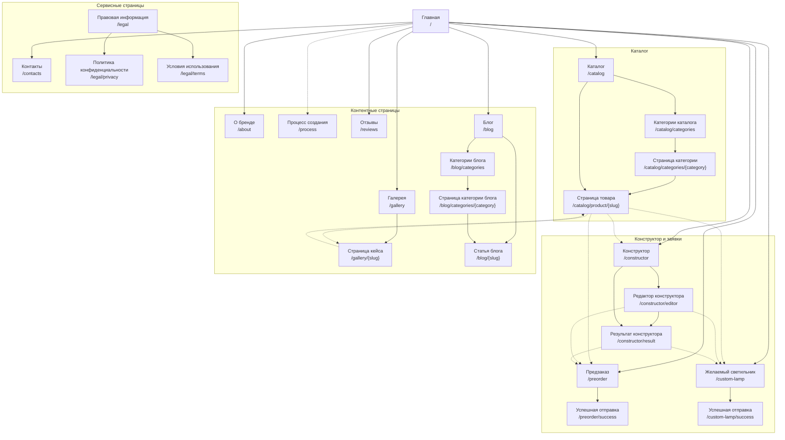

# Структура сайта Sparrow

> [!NOTE]
> Документ описывает информационную архитектуру сайта, маршруты, ключевые переходы и повторно используемые сценарии. Диаграммы ниже построены на Mermaid и корректно рендерятся на GitHub.

## Кратко

| Параметр | Значение |
| --- | --- |
| Проект | Sparrow |
| Всего страниц и состояний | 25 |
| Основная навигация | 7 разделов |
| Вторичная навигация | 5 разделов |
| Сквозные CTA и дубли сценариев | 10 |
| Ключевые сценарии | Предзаказ, кастомный светильник, переход из галереи к товару |

## Карта сайта

> [!TIP]
> Сплошные стрелки показывают основную структуру и вложенность страниц. Пунктиром отмечены сквозные CTA, повторно используемые блоки и переходы между сценариями.

## UML-диаграмма ключевых сценариев

```mermaid
stateDiagram-v2
    direction LR

    state "Главная\n/" as Home
    state "Каталог\n/catalog" as Catalog
    state "Категория\n/catalog/categories/{category}" as Category
    state "Товар\n/catalog/product/{slug}" as Product
    state "Предзаказ\n/preorder" as Preorder
    state "Успешная отправка\n/preorder/success" as PreorderSuccess

    state "Конструктор\n/constructor" as Constructor
    state "Редактор\n/constructor/editor" as Editor
    state "Результат\n/constructor/result" as Result
    state "Желаемый светильник\n/custom-lamp" as CustomLamp
    state "Успешная отправка\n/custom-lamp/success" as CustomLampSuccess

    state "Галерея\n/gallery" as Gallery
    state "Кейс\n/gallery/{slug}" as GalleryCase

    [*] --> Home

    Home --> Catalog : перейти в каталог
    Catalog --> Category : выбрать категорию
    Category --> Product : открыть товар
    Product --> Preorder : оформить предзаказ
    Preorder --> PreorderSuccess : отправить форму

    Home --> Constructor : перейти в конструктор
    Constructor --> Editor : начать сборку
    Editor --> Result : получить результат
    Result --> CustomLamp : отправить запрос
    CustomLamp --> CustomLampSuccess : отправить форму

    Home --> Gallery : открыть галерею
    Gallery --> GalleryCase : открыть кейс
    GalleryCase --> Product : перейти к товару

    Product --> Constructor : перейти в конструктор
    Product --> CustomLamp : запросить кастом
    Result --> Preorder : оформить предзаказ
```

## Разделы и маршруты

### Основные и сервисные страницы

| ID | Страница | Маршрут | Роль |
| --- | --- | --- | --- |
| `home` | Главная | `/` | Точка входа, содержит ссылки на ключевые разделы и CTA |
| `about` | О бренде | `/about` | Имиджевая страница о Sparrow |
| `process` | Процесс создания | `/process` | Дополнительная контентная страница о производстве |
| `reviews` | Отзывы | `/reviews` | Социальное доказательство |
| `contacts` | Контакты | `/contacts` | Контактная информация и способы связи |
| `legal` | Правовая информация | `/legal` | Родительский раздел для юридических страниц |
| `privacy` | Политика конфиденциальности | `/legal/privacy` | Юридическая страница |
| `terms` | Условия использования | `/legal/terms` | Юридическая страница |

### Каталог

| ID | Страница | Маршрут | Дочерние страницы / переходы |
| --- | --- | --- | --- |
| `catalog` | Каталог | `/catalog` | `catalog_categories`, `product_page` |
| `catalog_categories` | Категории каталога | `/catalog/categories` | `category_page` |
| `category_page` | Страница категории | `/catalog/categories/{category}` | `product_page` |
| `product_page` | Страница товара | `/catalog/product/{slug}` | CTA на `preorder`, `constructor`, `custom_lamp`, `gallery_case` |

### Конструктор и лид-формы

| ID | Страница | Маршрут | Дочерние страницы / переходы |
| --- | --- | --- | --- |
| `constructor` | Конструктор | `/constructor` | `constructor_editor`, `constructor_result` |
| `constructor_editor` | Редактор конструктора | `/constructor/editor` | `constructor_result`, `preorder`, `custom_lamp` |
| `constructor_result` | Результат конструктора | `/constructor/result` | CTA на `preorder`, `custom_lamp` |
| `preorder` | Предзаказ | `/preorder` | `preorder_success` |
| `preorder_success` | Успешная отправка предзаказа | `/preorder/success` | Финальное состояние формы |
| `custom_lamp` | Желаемый светильник | `/custom-lamp` | `custom_lamp_success` |
| `custom_lamp_success` | Успешная отправка формы | `/custom-lamp/success` | Финальное состояние формы |

### Контентные разделы

| ID | Страница | Маршрут | Дочерние страницы / переходы |
| --- | --- | --- | --- |
| `gallery` | Галерея | `/gallery` | `gallery_case` |
| `gallery_case` | Страница кейса | `/gallery/{slug}` | Переходы к `product_page`, `custom_lamp`, `preorder` |
| `blog` | Блог | `/blog` | `blog_article`, `blog_categories` |
| `blog_article` | Статья блога | `/blog/{slug}` | Детальная страница публикации |
| `blog_categories` | Категории блога | `/blog/categories` | `blog_category_page` |
| `blog_category_page` | Страница категории блога | `/blog/categories/{category}` | `blog_article` |

## Повторно используемые блоки и CTA

| ID | Блок / сценарий | Источник | Каноническая цель |
| --- | --- | --- | --- |
| `home_to_catalog` | Блок каталога на главной | `/` | `/catalog` |
| `home_to_constructor` | Блок конструктора на главной | `/` | `/constructor` |
| `home_to_preorder` | Форма предзаказа на главной | `/` | `/preorder` |
| `home_to_custom_lamp` | Форма желаемого светильника на главной | `/` | `/custom-lamp` |
| `product_to_preorder` | Кнопка предзаказа на странице товара | `/catalog/product/{slug}` | `/preorder` |
| `product_to_constructor` | Переход в конструктор со страницы товара | `/catalog/product/{slug}` | `/constructor` |
| `product_to_custom_lamp` | Заявка на кастомный светильник со страницы товара | `/catalog/product/{slug}` | `/custom-lamp` |
| `constructor_result_to_preorder` | Предзаказ из результата конструктора | `/constructor/result` | `/preorder` |
| `constructor_result_to_custom_lamp` | Заявка на кастомный светильник из результата конструктора | `/constructor/result` | `/custom-lamp` |
| `gallery_case_to_product` | Переход из кейса галереи к товару | `/gallery/{slug}` | `/catalog/product/{slug}` |

## Навигация

| Тип | Пункты |
| --- | --- |
| Основная | `home`, `about`, `catalog`, `constructor`, `gallery`, `blog`, `contacts` |
| Вторичная | `preorder`, `custom_lamp`, `process`, `reviews`, `legal` |

## Пользовательские сценарии

1. **Предзаказ:** `home` → `catalog` → `product_page` → `preorder` → `preorder_success`
2. **Кастомный светильник:** `home` → `constructor` → `constructor_editor` → `constructor_result` → `custom_lamp` → `custom_lamp_success`
3. **Вдохновение через галерею:** `home` → `gallery` → `gallery_case` → `product_page` → `preorder`
